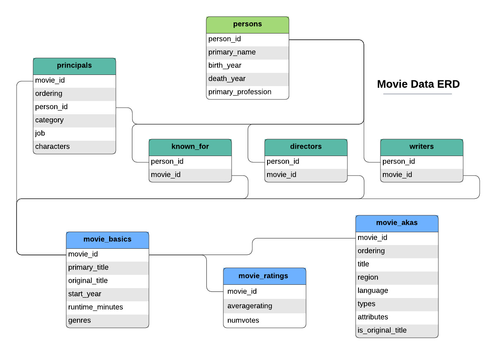
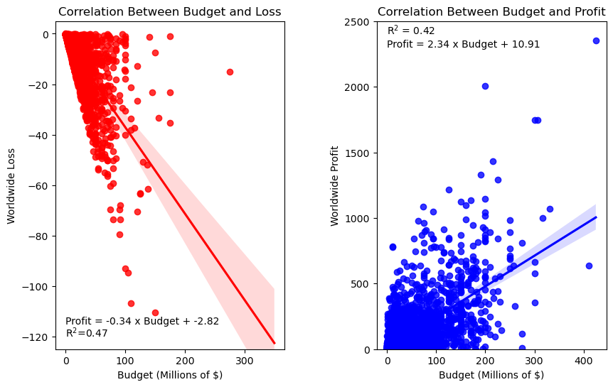
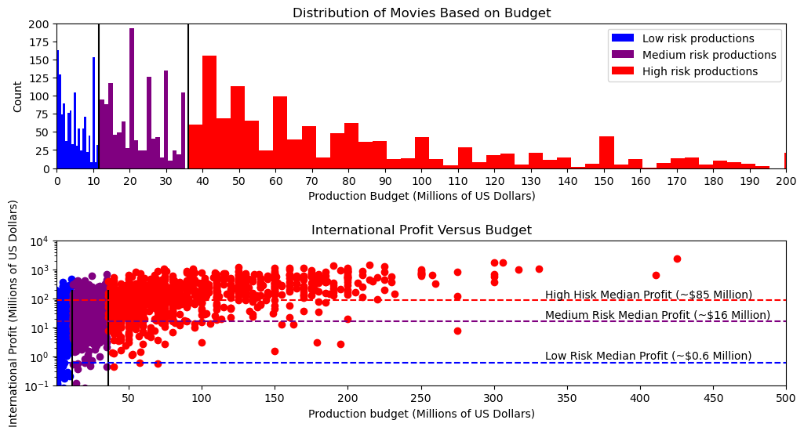
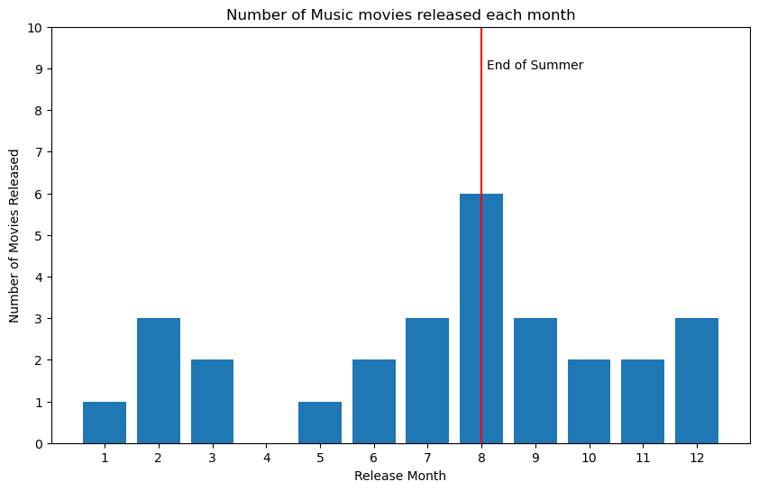
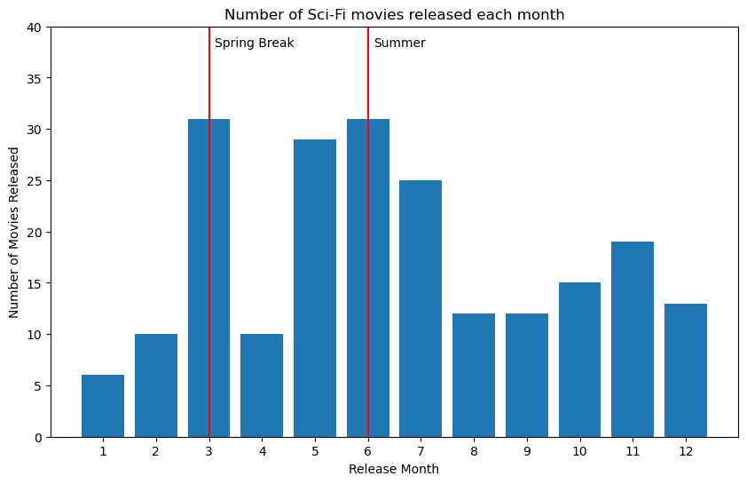

# Movie Industry Analysis

Authors: Cayke Felipe dos Anjos, Dolgor Purbueva


## Overview  
This project analyzes past movies data to offer strategic business recommendations for a new film studio. We aim to predict the most profitable strategies for film production and release by examining production budgets, gross revenues, net profits, genres, popularity, key staff and release timelines. As result this project provides three business recommendations: what genre should a future movie be, what budget to allocate and when to release it.

## Business Problem

The company is expanding its portfolio by investing in a new film studio. Launching a film studio in today's competitive entertainment industry requires a solid understanding of what drives movie success and attracts audiences. The movie industry is known for its substantial risks and high capital demands. Recent developments in AI have made video content creation faster and more efficient, increasing competition but also opening up new opportunities to enter the market.

Our project aims to analyze various datasets, including past movies' financial results, genre correlations, and movie ratings and popularity. By using data analysis techniques, we seek to gain valuable insights and identify patterns that can help shape the company's film production strategy. The goal is to provide three concrete business recommendations that maximize profitability and lower business risks, ensuring a strong entry into the market.

Questions we tried to answer with analysis:
* How should the movie be budgeted?
* What genres are most profitable?
* When should a movie be released?

## Data Understanding

We used datasets from Rotten Tomatoes, TheMovieDB, Bom Office Mojo, IMDB and The Numbers. Each dataset is of different size and contains different data catecories which might be seen as a limitation. For every question we answer we choose the most relevant dataset or merge some of them together for a fuller picture.

For budget related analysis we used IMDB and The Numbers. TheMovieDD dataset was used to explore movie ratings and popularity.

* One of the main metrics we explored is genre. [IMDB defines](https://help.imdb.com/article/contribution/titles/genres/GZDRMS6R742JRGAG?ref_=helpms_h#) genre as a category of artistic composition, characterized by similarities in form, style, or subject matter for a piece of content. [Reaserch by Mustafa Mahmoud Yousry](https://offscreen.com/view/going_to_the_movies) has shown that genre is the main decision factor for audience when chosing a movie to watch.


* We introduced the Return on Investment (ROI) metric as a standardized criterion to measure the financial success of a movie relative to its investments, as well as calculated movie net profit.

* We calculated Net Profit.




## A risk analysis of the movie production business

In order to provide any business recommendation, we need to understand how much money it is being bet and how much profit is desired in entering this industry. 


Our concept of risk group is then defined: a high risk group is one with a large budget that, if successful, will yield large profit, but if failed, can result in a great loss.

We start by cleaning The Numbers dataset and trying to explain correlations between profit, loss and budget.

The correlation can be seen in the following.


    

    


Based on the determination that a higher budget does indeed correlate with higher profits and losses, we divide the dataset into 3 groups with same size based on their risk level:
- High risk invetsment, higher budget movies that will probably not have a very high ROI but have the chance of making large profit if audiences enjoy it;
- Low risk investment, a lower cost that can have a high ROI based on the lower investment;
- Medium risk investment, that is just inbetween.

We first filter the dataset starting from 2000 to onli pick up recent trends and calculate the 2 budget thresholds for each group.


    We will work with 2 thresholds for our analysis. The threshold in between low and medium risk is at $11.50 millions and in between medium and high is $36.00 millions.


    

    


# Low Risk - Budget < $11.50 millions

The first thing we need to do is join the table with budgets and profit with the table that contains genres. Genres are in both IMDB and Movie DB meaning that in order to lose the least amount of information, we need to perform joins with different tables, concatenate and remove duplicates.


## Low Risk - Genre

After joining and cleaning tables, the dataframe has now all the information from genres and movies we need.


```python
df_lowrisk_exploded.groupby('genres')['ROI'].median().sort_values(ascending=False).reset_index().head()
```


<div>
<style scoped>
    .dataframe tbody tr th:only-of-type {
        vertical-align: middle;
    }

    .dataframe tbody tr th {
        vertical-align: top;
    }

    .dataframe thead th {
        text-align: right;
    }
</style>
<table border="1" class="dataframe">
  <thead>
    <tr style="text-align: right;">
      <th></th>
      <th>genres</th>
      <th>ROI</th>
    </tr>
  </thead>
  <tbody>
    <tr>
      <th>0</th>
      <td>Horror</td>
      <td>4.163727</td>
    </tr>
    <tr>
      <th>1</th>
      <td>Mystery</td>
      <td>3.810244</td>
    </tr>
    <tr>
      <th>2</th>
      <td>Sci-Fi</td>
      <td>1.751043</td>
    </tr>
    <tr>
      <th>3</th>
      <td>Romance</td>
      <td>1.036410</td>
    </tr>
    <tr>
      <th>4</th>
      <td>Thriller</td>
      <td>0.999622</td>
    </tr>
  </tbody>
</table>
</div>


```python
df_lowrisk_exploded.groupby('genres')['worldwide_net'].median().sort_values(ascending=False).reset_index().head()
```


<div>
<style scoped>
    .dataframe tbody tr th:only-of-type {
        vertical-align: middle;
    }

    .dataframe tbody tr th {
        vertical-align: top;
    }

    .dataframe thead th {
        text-align: right;
    }
</style>
<table border="1" class="dataframe">
  <thead>
    <tr style="text-align: right;">
      <th></th>
      <th>genres</th>
      <th>worldwide_net</th>
    </tr>
  </thead>
  <tbody>
    <tr>
      <th>0</th>
      <td>Horror</td>
      <td>15434588.0</td>
    </tr>
    <tr>
      <th>1</th>
      <td>Mystery</td>
      <td>14371155.5</td>
    </tr>
    <tr>
      <th>2</th>
      <td>Romance</td>
      <td>2681937.0</td>
    </tr>
    <tr>
      <th>3</th>
      <td>Fantasy</td>
      <td>2438210.0</td>
    </tr>
    <tr>
      <th>4</th>
      <td>Thriller</td>
      <td>1889796.0</td>
    </tr>
  </tbody>
</table>
</div>


Horror and Mystery have very similar ROI's and international profits. In order to determine which is more profitable, we use a t-test.


    T scores for profit of: 
    $20 million = -3.6017645678829213
    $35 million = -0.6797071532264725
    $50 million = 2.242350261429976
    
    Probability for profit of: 
    $20 million = 0.9997733937949502
    $35 million = 0.7510316219789762
    $50 million = 0.013343571801237686
    Average cost of Horror movies below $11.50 million are $4.51 millions


    T scores for profit of: 
    $20 million = -2.769851906203676
    $35 million = 0.009069978403655641
    $50 million = 2.7879918630109874
    
    Probability for profit f: 
    $20 million = 0.9966272916473534
    $35 million = 0.49639116153943286
    $50 million = 0.003203179748977769
    Average cost of Mystery movies below $11.50 million are $4.97 millions


### This means that Horror movies will cost about the same and will have a higher chance of getting more profit.

## Low Risk - Director

Knowing which genre is more profitable, we need to choose directors who succed in making profitable horror movies. For this, we do not restrict the detaframe to early releases.


### For the animation movie, we recommend the directors:
- Jordan Peele;
- John R. Leonetti.

## Low risk - Release Month


    

    


Two options of release dates.
- April - Easter: a lot of Horror movies have religious subtext;
- November - Halloween.

We recommend releasing the movie during Halloween.

## Low risk - Runtime


We analyze the genre distribution of runtimes and choose an interval with 95% confidence. Runtime should be around 93 to 98 minutes


# Medium Risk

We now repeat the same steps with medium risk budgets.


## Medium Risk - Genre


    T scores for profit of: 
    $20 million = -2.9818762248564195
    $40 million = -1.2232467444970372
    $60 million = 0.5353827358623451
    $80 million = 2.2940122162217276
    
    Probability for profit f: 
    $20 million = 0.9980541488043901
    $40 million = 0.88741469485021
    $60 million = 0.2970062721670568
    $80 million = 0.012334480186491636
    
    Average cost of horror movies above $11.50 millions but below $36.0 millions are $22.15 millions


    T scores for profit of: 
    $20 million = -2.418205698375475
    $40 million = -1.3112389607422235
    $60 million = -0.20427222310897178
    $80 million = 0.90269451452428
    
    Probability for profit f: 
    $20 million = 0.9886917795972838
    $40 million = 0.8995902806067388
    $60 million = 0.5801636239084736
    $80 million = 0.18733560352033518
    
    Average cost of Music movies above $11.50 millions but below $36.0 millions are $21.93 millions


    T scores for profit of: 
    $20 million = -5.975203447407423
    $40 million = -1.3002000216391634
    $60 million = 3.3748034041290964
    $80 million = 8.049806829897356
    
    Probability for profit f: 
    $20 million = 0.9999999951982208
    $40 million = 0.9025279099464543
    $60 million = 0.00043918078264115756
    $80 million = 2.942091015256665e-14
    
    Average cost of Comedy movies above $11.50 millions but below $36.0 millions are $22.78 millions


    T scores for profit of: 
    $20 million = -2.645913242794863
    $40 million = -0.21811964303040776
    $60 million = 2.2096739567340475
    $80 million = 4.637467556498502
    
    Probability for profit f: 
    $20 million = 0.9938754234783517
    $40 million = 0.5856801126099807
    $60 million = 0.01698172621983829
    $80 million = 2.5223421907805132e-05
    
    Average cost of Fantasy movies above $11.50 millions but below $36.0 millions are $22.54 millions


    T scores for profit of: 
    $20 million = -2.439442048658327
    $40 million = 0.9825688524966413
    $60 million = 4.40457975365161
    $80 million = 7.826590654806577
    
    Probability for profit f: 
    $20 million = 0.991253876712623
    $40 million = 0.16475981598027056
    $60 million = 2.058929195369874e-05
    $80 million = 3.258959768714931e-11
    
    Average cost of Adventure movies above $11.50 millions but below $36.0 millions are $25.94 millions


    T scores for profit of: 
    $20 million = -2.561640089191682
    $40 million = 0.019484380665674456
    $60 million = 2.6006088505230314
    $80 million = 5.181733320380388
    
    Probability for profit f: 
    $20 million = 0.9929966155721592
    $40 million = 0.492272414595484
    $60 million = 0.0063533113993345935
    $80 million = 2.785374063951629e-06
    
    Average cost of Family movies above $11.50 millions but below $36.0 millions are $22.77 millions


### Genre for a medium risk production will be Music

## Medium Risk - Director


Unfortunately, we just have one movie for each director, which does not allow us to extrapolate much.

For lack of data we recommend the director Damien Chazelle, as his Music movie sold 60% more than the second place.

## Medium Risk - Release Date


    

    


### For some reason Music movies are more popular in August so we recommend this month for release.

## Medium risk - Runtime


The duration of the Music movie should be in between 96 and 113 minutes.


# High risk

We now do the same with the higher risk budget.


## High risk - Genre


    T scores for profit of: 
    $100 million = -6.942394636239825
    $200 million = -3.5913826663853423
    $300 million = -0.24037069653085955
    $350 million = 1.4351352883963817
    
    Probability for profit f: 
    $100 million = 0.9999999998168365
    $200 million = 0.9997460681006808
    $300 million = 0.5947373310370614
    $350 million = 0.07715392088809236
    
    Average cost of animation movies above $20 million are $109.87 millions


    T scores for profit of: 
    $100 million = -9.263001427062187
    $200 million = -5.252235667837255
    $300 million = -1.2414699086123224
    $350 million = 0.7639129710001439
    
    Probability for profit f: 
    $100 million = 1.0
    $200 million = 0.9999998176509557
    $300 million = 0.8920979817943603
    $350 million = 0.22288422982561462
    
    Average cost of Sci-Fi movies above $20 million are $133.26 millions


    T scores for profit of: 
    $100 million = -10.136314209284892
    $200 million = -4.824164279336895
    $300 million = 0.4879856506111035
    $350 million = 3.1440606155851025
    
    Probability for profit f: 
    $100 million = 1.0
    $200 million = 0.999998883029583
    $300 million = 0.31295704864162976
    $350 million = 0.0009159736985646649
    
    Average cost of Adventure movies above $20 million are $127.28 millions

We go with Sci-Fi for the chance to make more profit.


## High Risk - Directors

Finally, for high risk budget.


Our recommendation for top directors are (in order of profit):
- For movies about robots, Michael Bay;
- For movies based on comics, Anthony Russo;
- For movies based on books, Francis Lawrence;

## High Risk - Release Month

    

    


Movie should be released either in March for Spring Break or in June for Summer.

## High Risk - Runtime


    The duration of the Sci-Fi movie should be in between 115 and 123 minutes.


## Recommendations

**Low Risk:**
* Genre: Horror
* Director: Jordan Peele or John R. Leonetti
* Best release date: Halloween (October) or Easter (April)
* Runtime: 96 to 100 minutes
* Average cost: $7.53 millions

**Medium Risk:**
* Genre: Music
* Director: Damien Chazelle (La La Land)
* Best release date: August
* Runtime: 96 to 113 minutes
* Average cost: $21.93 millions

**High Risk:**
* Genre: Sci-Fi
* Director: Michael Bay (Transformers), Anthony Russo (Marvel), Francis Lawrence (Hunger Games)
* Best release date: March (Spring Break) or June (Summer)
* Runtime: 112 to 120 minutes
* Average cost: $155.73 millions


## Next Steps

For further steps we recommend expanding analysis into several directions:

* Explore data on profits and movie perfomance on streaming services.

* Add budgets spent on marketing. ["Many people get confused when they hear that a movie with a production budget of 100 million grosses 150 million worldwide and loses money. But the brutal fact is that movies get sunk by the massive costs of marketing and distribution all the time."](https://www.studiobinder.com/blog/production-budget/)


## Contact
For contact with the authors of the project, please feel free to add us on LinkedIn and message us or check out our other projects.

[LinkedIn: Cayke Felipe dos Anjos](https://www.linkedin.com/in/cayke-fda/)

[GitHub: Cayke Felipe dos Anjos](https://github.com/cayke-fda)


[LinkedIn: Dolgor Purbueva](https://www.linkedin.com/in/purbuyeva/)

[GitHub: Dolgor Purbueva](https://github.com/dolgorp)
